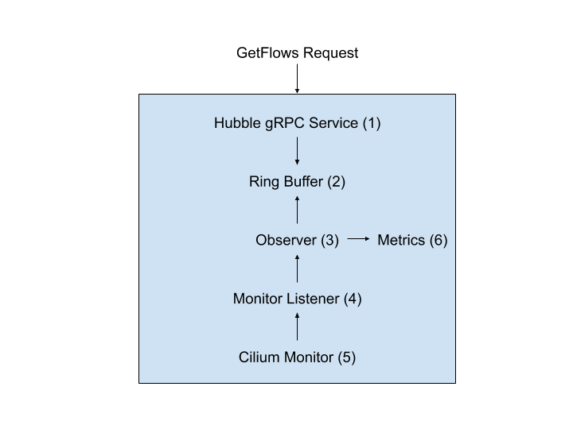

****************
Hubble internals
****************

.. note:: This documentation section is targeted at developers who are willing
          to contribute to Hubble. For this purpose, it describes Hubble
          internals.

.. note:: This documentation covers the Hubble server (sometimes referred as
          "Hubble embedded") and Hubble-relay components but does not cover the
          Hubble UI and CLI.

Hubble builds on top of Cilium and eBPF to enable deep visibility into the
communication and behavior of services as well as the networking infrastructure
in a completely transparent manner.

One of the design goals of Hubble is to achieve all of this at large scale.
Although the initial release of Hubble was a standalone component, as of Cilium
1.8, Hubble server is embedded into the Cilium agent. This decision has been
taken due to performance concerns and drift with the Hubble standalone approach
as Hubble had to replicate a lot of the Cilium state in its process by calling
Cilium API. This not only contributed to performance overhead but more
importantly was the source of a lot of code duplication and maintenance burden.

.. note:: This guide does not cover Hubble in standalone mode, which is
          deprecated.

Hubble Architecture
===================

Hubble exposes gRPC services from the Cilium process that allows clients to
receive flows and other type of data.

Hubble server
-------------

The Hubble server component implements two gRPC services. The **Peer service**,
which is only served on a local Unix domain socket, and the **Observer service**
which may optionally be exposed via a TCP socket in addition to a local Unix
domain socket.

The Observer service
^^^^^^^^^^^^^^^^^^^^

The Observer service is the principal service. It makes two methods available:
``GetFlows`` and ``ServerStatus``.  While the ``ServerStatus`` method is pretty
straightforward (it provides metrics related to the running server), the
``GetFlows`` one is far more sophisticated and the more important one.

Using ``GetFlows``, callers can get a stream of payloads. Request parameters
allow callers to specify filters in the form of blacklists and whitelists to
allow for fine grain filtering of data.

In order to answer ``GetFlows`` requests, Hubble stores monitoring events from
Cilium's event monitor into a ring buffer structure.  Monitoring events are
obtained by registering a new listener to Cilium's monitor.  The ring buffer is
capable of storing a configurable amount of events in memory. Events are
continuously consumed, overriding older ones once the ring buffer is full.

For efficiency, the internal buffer length is a bit mask of ones + 1. The most
significant bit of this bit mask is the same position of the most significant
bit position of 'n'. In other terms, the internal buffer size is always a power
of 2. As the ring buffer is a hot code path, it has been designed to not employ
any locking mechanisms and uses atomic operations instead. While this approach
has performance benefits, it also has the downsides of being a complex
component and that reading the very last event written to the buffer is not
possible as it cannot be guaranteed that it is not still in the process of
being written.

Due to its complex nature, the ring buffer is typically accessed via a ringer
reader that abstracts the complexity of this data structure for reading. The
ring reader allows reading one event at the time with 'previous' and 'next'
methods but also implements a follow-mode where events are continuously read as
they are written to the ring buffer.

The Peer service
^^^^^^^^^^^^^^^^

The Peer service lists Hubble peers and notifies of changes. This allows the
caller to know about all Hubble instances and query their respective gRPC
services. This service is typically only exposed on a local Unix domain socket
and is primarily used by Hubble-relay in order to have a cluster-wide view of
all Hubble instances.

The Peer service obtains peer change notifications by subscribing to Cilium's
node manager. To this end, it internally defines a handler that implements
Cilium's datapath node handler interface.

Hubble-relay
------------

.. note:: At the time of this writing, the hubble-relay component is still
          work in progress and may undergo major changes. For this reason,
          internal documentation about Hubble-relay is limited.

Hubble-relay is a component that was introduced in the context of multi-node
support. It connects to all Hubble peers and consume their gRPC API in order to
provide a more rich API that covers events from across the entire cluster.
